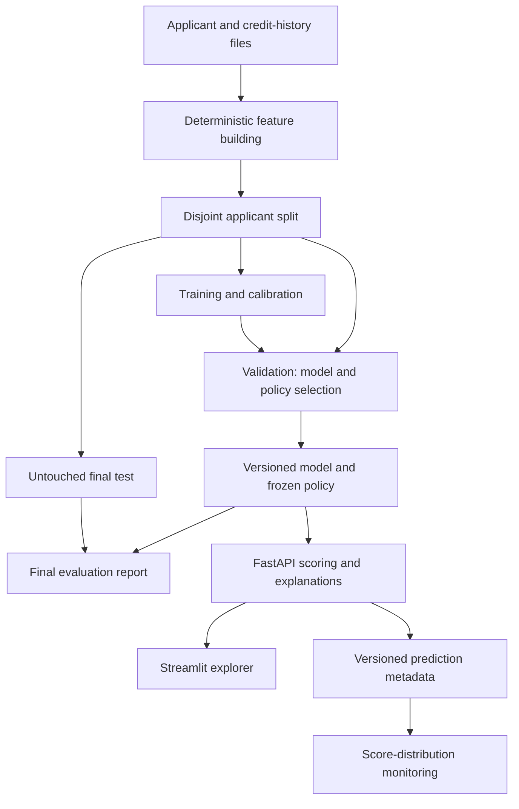

# Credit Risk Decision & Monitoring System

A credit-risk portfolio project that connects applicant-level default predictions to lending-policy decisions, financial simulations, explanations, and model monitoring.

**Current evidence:** the repository includes a reproducible synthetic demonstration and automated checks. Real-data performance must be established by supplying the original dataset and running the new evaluation pipeline. Synthetic metrics are never presented as real lending results.

## What you can explore

- **Policy explorer:** change approval thresholds, margin, and loss assumptions; compare approval rates and simulated profit on validation applicants.
- **Applicant scoring:** single-applicant and CSV-batch predictions through FastAPI, with validated inputs and SHAP explanations.
- **Model quality:** logistic regression versus raw/calibrated XGBoost candidates, probability-quality metrics, calibration plots, and a frozen final test report.
- **Stress scenarios:** distinguish stress on loans already funded from policy decisions for future applications.
- **Monitoring:** version-matched prediction-score PSI, explicit readiness, and prediction audit metadata.

## Quick start: synthetic demo

Requires Python 3.11 or 3.12; this workspace was tested on Python 3.12. From the repository root:

```bash
python -m venv .venv
source .venv/bin/activate
python -m pip install -r requirements-dev.txt
python -m scripts.run_demo
```

On Windows, activate with `.venv\Scripts\activate` instead. Linux users can reproduce the pinned dependency set with `python -m pip install -r requirements-dev.txt -c requirements-linux.lock`.

Start the API in one terminal:

```bash
source .venv/bin/activate
export CREDIT_RISK_MODEL_DIR="$PWD/artifacts/demo/models"
export CREDIT_RISK_LOG_PATH="$PWD/artifacts/demo/prediction_logs.jsonl"
python -m uvicorn src.inference.api:app --host 127.0.0.1 --port 8000
```

Start the dashboard in another terminal:

```bash
source .venv/bin/activate
export CREDIT_RISK_MODEL_DIR="$PWD/artifacts/demo/models"
export CREDIT_RISK_LOG_PATH="$PWD/artifacts/demo/prediction_logs.jsonl"
python -m streamlit run src/dashboard/app.py --server.address 127.0.0.1
```

Open the dashboard at `http://127.0.0.1:8501` and API documentation at `http://127.0.0.1:8000/docs`.

With Make installed, the equivalent commands are `make demo`, then `make api-demo` and `make ui-demo` in separate terminals.

### Docker Compose

```bash
docker compose up --build api dashboard
```

This trains an isolated synthetic demo, then starts the API and dashboard. Host ports bind to loopback. Generated artifacts live in a named Docker volume. The Docker setup is supplied with a CI smoke test; it could not be executed in the development workspace because Docker was unavailable.

## Train on the original data

Obtain the dataset under its applicable access terms and place these files in `data/raw/`:

- `application_train.csv`
- `bureau.csv`
- `previous_application.csv`

The builder accepts the Home Credit-shaped schema used by the original project. It performs deterministic per-applicant history aggregation, handles the employment sentinel, and derives financial ratios. Learned imputation and encoding occur later, inside the training pipeline.

```bash
python -m src.features.build_features
python -m src.models.train --data data/features/model_input.parquet
```

Training saves a **candidate** without switching the active model. Inspect its `report.json` and `selection.json`, then activate the desired local artifact explicitly:

```bash
python -m src.mlops.promote_model --artifact RUN_ID/bundle.joblib --activate
```

Replace `RUN_ID` with the printed run directory name. For a new local setup, `python -m src.models.train --activate` both trains and activates. Restart the API and dashboard after activation. Clear the demo environment variables when serving real models; the default model directory is `models/`.

The repository does not include the user's original data or trained pickle. Old artifacts are not silently reused. Version-2 artifacts must be generated by the new pipeline.

## Evaluation design

Each applicant appears in exactly one of four stratified subsets. Duplicate applicant IDs are rejected; identifiers and target labels are excluded from the model inputs.

| Subset | Approximate share | Purpose |
|---|---:|---|
| Training | 50% | Fit preprocessing and candidate classifiers |
| Calibration | 15% | Fit sigmoid calibration while the base classifier stays frozen |
| Validation | 15% | Compare candidates and select the approval threshold |
| Final test | 20% | Report the frozen model and policy, with a logistic baseline |

XGBoost is trained with a binary classification objective. **Candidate and policy selection**, rather than the training loss itself, use simulated profit from validation outcomes. Raw and calibrated variants compete; calibration is not assumed to improve every dataset.

The final report records ROC-AUC, average precision, Brier score, log loss, calibration bins, approval/default rates, financial simulations, software versions, dataset fingerprint, and split counts. The test set must not become a repeated tuning target. This random applicant split does not establish future-period performance; a temporal evaluation requires appropriate timestamps and a separately defined experiment.

## Financial interpretation

For an approved applicant with loan amount `A`, default probability `p`, repayment margin `m`, and loss fraction on default `L`:

```text
Expected profit if funded = A × ((1 − p) × m − p × L)
Outcome-based simulated profit = A × ((1 − y) × m − y × L)
```

Here `y` is the recorded binary default outcome. Rejected applications contribute zero to portfolio profit. Amounts remain in the dataset's currency units (CU).

The outcome-based calculation prevents a model from looking profitable merely by predicting implausibly low default probabilities. It is still a simulation: principal proxies exposure, margin/LGD are assumptions, and funding costs, prepayments, duration, actual recoveries, and selection bias are not modeled. It is not measured bank revenue.

## Architecture



## API contract

| Endpoint | Purpose |
|---|---|
| `GET /health` | Process health and model readiness flag |
| `GET /ready` | 200 when a verified model is loaded; otherwise 503 |
| `GET /schema` | Model-specific input fields, economic policy, and example request |
| `POST /predict` | One applicant; SHAP enabled by default |
| `POST /predict/batch` | Up to 100 applicants; explanations optional and limited to 10 |

Use `/schema` to obtain the complete input contract. The request body is `{"features": {...}, "explain": true}`. Batch requests use `{"applicants": [{...}], "explain": false}`.

All source feature keys are required; nullable values must be supplied explicitly as `null`. Extra fields, identifiers, target labels, nonfinite numeric values, invalid core amounts, and inconsistent loan counts return 422. Known financial ratios are recomputed from source values, preventing stale user-supplied ratios. Unknown categorical values are handled by the fitted encoder.

SHAP contributions are grouped back to source features. They explain the base classifier's **log odds**, not causal effects or additive contributions to a calibrated probability. This distinction is exposed in every explanation response.

Prediction logs contain request/time/model/decision metadata, not applicant features. Model artifacts use joblib and must come from a trusted source; checksums verify integrity, not trust. The local demo does not include authentication or a public deployment. Add suitable access control before exposing it to external traffic.

## Checks and monitoring

```bash
python -m pytest -q
python -m ruff check src scripts tests
python -m ruff format --check src scripts tests
python -m src.mlops.drift_monitor --model-dir artifacts/demo/models --log-path artifacts/demo/prediction_logs.jsonl
```

Tests cover applicant isolation, training-only preprocessing, test-label independence of model selection, exposure-weighted economics, training/serving consistency, SHAP additivity, input failures, readiness, artifact integrity, drift edge cases, and dashboard interactions.

PSI compares scores only for the active model version. Its 0.2 threshold is a demonstration heuristic. A score shift does not by itself establish lost accuracy, concept drift, or a need to retrain. Monitoring accuracy requires later repayment outcomes, which the current logs do not contain.

## Review and interview materials

- [Two-minute demo walkthrough](docs/DEMO.md)
- [Interview learning guide](docs/INTERVIEW_GUIDE.md)
- [Implementation changes and limitations](docs/CHANGELOG.md)
- [Synthetic demonstration results](docs/DEMO_RESULTS.md)

Earlier experimental scripts are preserved under `experiments/legacy/` for learning and comparison. They are not part of the supported training or scoring path. In particular, artificial default relabeling is not a valid source of real-world performance claims.
